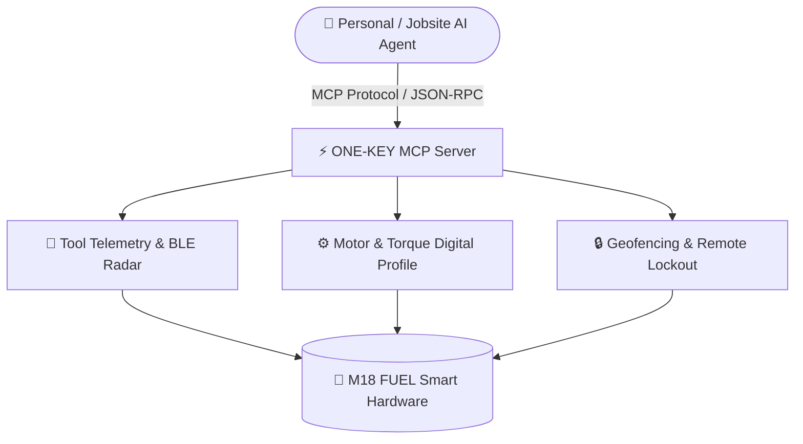

# genpark-milwaukee-onekey-smart-tool-inventory-skill

<div align="center">

[](https://www.python.org/)
[](LICENSE)
[](https://genpark.ai/mcp)
[](https://genpark.ai)
[-brightgreen.svg?style=for-the-badge)](requirements.txt)

<p align="center">
  <b>Production-Grade Smart Hardware & Industrial Tool Fleet MCP Skill</b> • <b>100% Standard Library Python</b> • <b>Native Model Context Protocol (MCP)</b>
</p>

[🌐 GenPark MCP Hub](https://genpark.ai/mcp) • [📦 Milwaukee Tool ONE-KEY](https://www.milwaukeetool.com/Innovations/ONE-KEY) • [📖 Documentation](#quickstart)

</div>

---

## 📌 Overview & Capability

**genpark-milwaukee-onekey-smart-tool-inventory-skill** is a deterministic, zero-dependency Python skill and native Model Context Protocol (MCP) server engineered for smart hardware agents, industrial jobsite robotics, and connected tool management. Distilled directly from **Milwaukee Tool's M18 FUEL with ONE-KEY** technology, it enables AI agents to interface seamlessly with industrial power tools:

* 📡 **Bluetooth (BLE) & Cellular Asset Tracking**: Real-time proximity radar, geofencing breaches, and misplaced tool recovery.
* ⚙️ **Digital Profile & Torque Calibration**: Wirelessly program repeatable torque limits (within ±5%), speed cutoffs, and ramp-up timings.
* 🔒 **Smart Security Lockout**: Remotely lock missing tools and render them inoperable upon jobsite perimeter violations.
* 📊 **Fleet Telematics & Compliance Logging**: Audit trigger pulls, operating temperatures, and motor brush life cycles.

> **Executive Capability**: GenPark AI Agent Skill - Milwaukee Tool M18 FUEL with ONE-KEY smart cordless hardware, BLE proximity tracking, torque calibration & jobsite lockout.

---

## 🏗️ Architecture & IoT Flow



---

## 🚀 Quickstart & Usage

### 1. Direct Python Client Execution
```bash
python example_usage.py
```

### 2. Programmatic Integration
```python
from client import MilwaukeeOneKeySmartToolSkill

client = MilwaukeeOneKeySmartToolSkill()
result = client.run_benchmark_smart_tools()
print(result)
```

---

## 🔌 Model Context Protocol (MCP) Setup

Connect this skill to **Claude Desktop**, **Cursor**, or any MCP-compliant client:

### `claude_desktop_config.json`
```json
{
  "mcpServers": {
    "genpark-milwaukee-onekey-smart-tool-inventory-skill": {
      "command": "python",
      "args": ["/path/to/genpark-milwaukee-onekey-smart-tool-inventory-skill/mcp_server.py"]
    }
  }
}
```

### Direct MCP Testing
```bash
python mcp_server.py --test
```

---

## 📊 Technical Specifications

| Parameter | Type | Required | Description |
|---|---|:---:|---|
| `tool_serial` | `string` | Yes | Hardware serial / BLE MAC address of the connected M18 tool |
| `operation` | `string` | Yes | Action: `locate`, `lock`, `unlock`, `configure_torque`, `fetch_telematics` |
| `parameters` | `dict` | No | Torque limits (ft-lbs), RPM ceiling, or geofence boundary coordinates |

---

<div align="center">
  <sub>Maintained with ❤️ by <b><a href="https://genpark.ai">GenPark AI Engineering</a></b> • Distilled from <b><a href="https://www.milwaukeetool.com">Milwaukee Tool</a></b> 🌍</sub>
</div>
